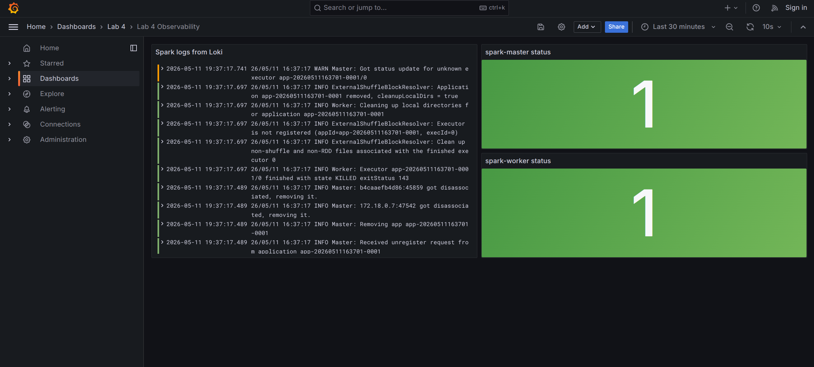

# Лабораторная работа 4: Loki + Prometheus + Grafana

## О чём работа

Проект поднимает Airflow, Spark и стек наблюдаемости в Docker Compose. Airflow запускает Spark-задачу, Alloy собирает логи Airflow и Spark в Loki, Prometheus собирает метрики Airflow/Spark, а Grafana показывает готовый дашборд с логами и статусом Spark target-ов.

## Сервисы

| Сервис | Адрес | Назначение |
|---|---|---|
| Airflow UI | http://localhost:8080 | Управление DAG-ами, логин/пароль: `airflow` / `airflow` |
| Spark Master UI | http://localhost:4040 | Состояние Spark-кластера |
| Spark Worker UI | http://localhost:4041 | Состояние worker-а |
| Grafana | http://localhost:3000 | Дашборд `Lab 4 Observability` |
| Prometheus | http://localhost:9090 | Метрики и target-ы |
| Loki | http://localhost:3100 | Хранилище логов |

## Что добавлено

- `alloy.conf` - сбор логов Airflow и Spark в Loki
- `prometheus.yml` - сбор метрик Airflow, Spark master и Spark worker
- `grafana/provisioning/` - автоматическое создание datasource-ов Loki/Prometheus и дашборда
- `dags/spark_pipeline.py` - DAG, который запускает Spark job
- `spark/data_pipeline_spark.py` - Spark-приложение с расчётом статистики
- `spark/conf/metrics.properties` - Prometheus endpoint-ы для Spark metrics

## Запуск

```bash
docker compose up -d --build
```

Проверить контейнеры:

```bash
docker compose ps
```

Запустить Spark DAG вручную:

```bash
docker compose exec airflow-webserver airflow dags trigger spark_data_pipeline
```

После успешного запуска результат появится в `output/spark_result.json`, а логи - в `logs/` и `spark/logs/`.

## Что смотреть в Grafana

Откройте http://localhost:3000 и перейдите в дашборд `Lab 4 Observability`.

На дашборде есть три панели:

1. `Spark logs from Loki` - запрос `{job="spark_logs"}`
2. `spark-master status` - запрос `up{job="spark-master"}`
3. `spark-worker status` - запрос `up{job="spark-worker"}`

## Скриншот дашборда



Для отчёта нужен скриншот этого дашборда и новые конфиги `alloy.conf`, `prometheus.yml`, `grafana/provisioning/`.

## Остановка

```bash
docker compose down -v
```
